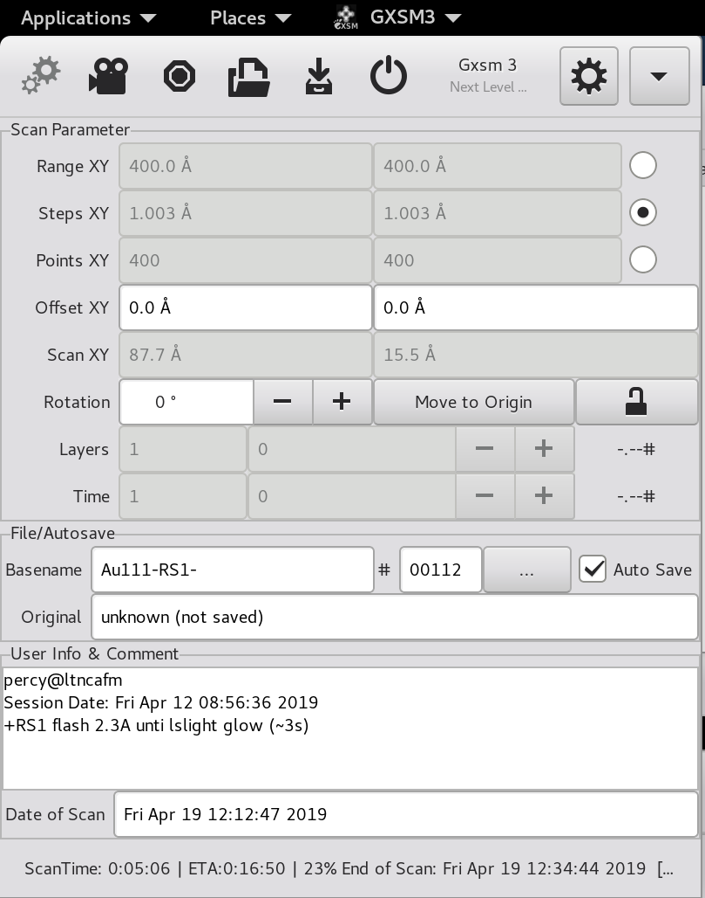

# The Main Window {#ch:main}

After startup, the main window appears. The actual user interface
provided by the main window depends on the configuration (compare
Fig. [\[fig:screenshot:gxsm3-main\]](#fig:screenshot:gxsm3-main){reference-type="ref"
reference="fig:screenshot:gxsm3-main"}. GXSM can be configured for use
with SPM techniques, which is the default.

The main window provides two different functions: Firstly, it has a menu
bar with pull-down menus. These menus provide the user with the usual
`File` and `Help` menus which can be found in practically every
mouse-driven software piece. Some of these pull-down menus interact
with (`Math`) or start-up (`Windows`) other windows. Secondly, the
main menu contains a large number of control fields which can be used,
e.g., to control an instrument, or just display certain parameters.
These control fields are described in the following two sections.

## Understanding the main window's entries: SPM mode {#sec:main:spmentries}

This section explains the contents of the main window (see
Fig. [\[fig:screenshot:gxsm3-main\]](#fig:screenshot:gxsm3-main){reference-type="ref"
reference="fig:screenshot:gxsm3-main"}) for Gxsm running in SPM mode.
The main window contains from top to bottom the menubar, a taskbar, the
scan parameter, view mode, file, and info/comment sections, and a status
and progress bar. The scan parameter and info sections of the main
window are used both for entering parameters during data taking and
displaying them after loading data.

### Scan parameters

Each scan or image is characterized by its size and resolution. The
size, or *Range XY*, gives the scale of the image like the scale
of a city map and denotes the height and width of the scanned area. The
resolution is determined by either the distance between the single scan
points/pixels given by *Steps XY* or the number of points in X and
Y direction given by *Points XY*. Given two of these parameters,
the third one can be computed. The check box *Calculate*
determines, which of them is calculated by GXSM. For instance, if
*Steps* is checked, a change of *Range XY* results
automagically in a new value for *Steps XY*.

The parameter *Offset XY* determines the distance of the zeropoint
of the image coordinates from the center of the physical scanrange. The
actual location of the zeropoint within the scan depends on the source
of the data. If the data was acquired using GXSM, the zeropoint is the
middle of the topmost line. Using *Rotation*, the imaged area can
be rotated. Both inputs using numeric values and the scrollbar are
possible.

GXSM can be used to do spatially resolved spectroscopy ("probing") and
time dependent measurements ("movies"). Channels containing probing (or
time dependent) data are essentially three-dimensional (3D) datasets. In
these 3D datasets the X and Y coordinates correspond to the 2D position
like in conventional SPM images. The third dimension can be the voltage
V or the time t. GXSM displays only one slice corresponding to one V or
one t value at a time. *Layers* denotes the number of points in
the V direction, *Time* in the temporal direction.

*VRange Z* and *VOffset Z* are used for the visualization of
the scan data. They do not influence the data itself. See also
Sec. [\[bright-contrast\]](#bright-contrast){reference-type="ref"
reference="bright-contrast"}.

### File and user information

For the users convenience, the filenames for saving new data are
automatically generated. The filename is set together using the
*Basename* is the login name of the GXSM user. The scheme used for
generating the filename from the scan number can be configured in the
Preferences on the tab *User*. The scan number is followed by
"-M-" if the image contains additional information besides the bare 2D
image like events and point probes. The next part of the file name
indicates the scan direction: Xp or Xm. Finally, the channel name is
attached to the file name. The channel name can be configured on the tab
*DataAq* of the Preferences window. *Auto* Save is checked,
each new scan is automatically saved after the scan is finished.

During image analysis it is often convenient to save the "enhanced"
images using an easy to memorize name. Nethertheless, it is often
necessary to get back to the original data. For this purpose,
*Originalname* shows the name of the original data file. This
feature works only for files saved using GXSM's NetCDF format.

The *Comment* field allows adding comments to scan data, e.g. the
name of the sample. Again, saving this information is supported best for
the NetCDF file format.

Hint: If your dataformat is not natively supported by GXSM, but can be
exported to ASCII, consider using `ncdump` and `ncgen` to create a
nc-file from your data. Running ncdump on any GXSM-nc-file shows you
which parameters are necessary, insert your data in the ASCII output and
revert the ASCII-file back to NetCDF using ncgen.

## Drag and Drop {#sec:main:DnD}

Gxsm accepts all loadable files via 'drag and drop', e.g. from the
Nautilus and understands VFS file paths. Even dragging URL's pointing to
loadable files on the web is possible.

If you drop a file on a channel-window, it is loaded into that channel.
To create a new window with a new channel bound to it, drop the file
above the main window.

## Keyboard-Accelerators {#sec:main:accel}

Most common used action on a scan-view are assigned to keyboard
accelerators, this is indicated by the Key-Symbol on the right side of a
menu entry. (See pull down/pop-up menus on scan 2D view). F2 for example
triggers a auto-display (auto scale to min-max of all data or via active
rectangle area selection).

