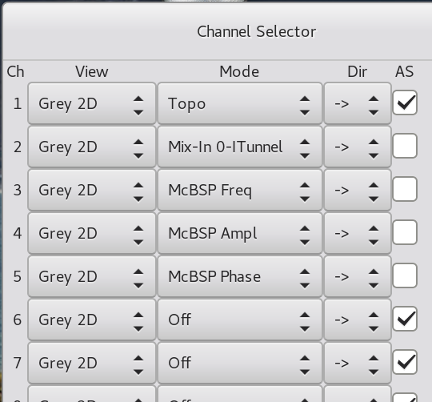

# Channels {#ch:channels}

One of the most important features of Gxsm is the
multichannel-capability. Multichannel-capability describes the
simultaneous data acquisition and display from different sources. You
may e.g. at the same time measure topography and friction-forces with
the AFM. Additionally to the simultaneous acquisition of different
signals, the multi-channel feature of GXSM can be used to load multiple
images and, e.g. compare them, or apply more complex operations to them.
Furthermore, it serves as a history mechanism during image manipulation,
because the result of any mathematical operation on one channel does not
overwrite it but is stored in a new channel.

## The Channel Dialog {#sec:channels:dialog}

The channel dialog pops up selecting *Ch. Sel.* in the
*Windows* menu of the main window. You can use it, to select the
displaymode (*View*) and the source for data acquisition
(*Mode*) for any channel.

One of the following modes can be chosen, see
[\[Gxsm-Visualisation\]](#Gxsm-Visualisation){reference-type="ref"
reference="Gxsm-Visualisation"} for details:

1.  *No*: During data acquisition no data is displayed --
    background storage/saving only. You can switch view mode any time.

2.  *Grey 2D*: The data are displayed as a grayscaled/false-color
    image.

3.  *Surface 3D*: Three/multi dimensional data/scan viewer.
    OpenGL (4.0 minimum) based. Can display volume data and slices of
    multilayered data.

4.  *Profile* 1D: Profile view of the current or all lines.

Usually you will use the mode *Grey 2D* for data acquisition. If
you want to see the line profiles of the actual scan line, right-click
on the window of the channel, select *view* and activate
*red* Profile.

For processing of data several modes are available:

1.  *Off* or *On*. Off deletes the channel.

2.  *Active*. The most important mode, it sets the active
    channel. All image manipulation is done using this channel. Only one
    channel can be *Active* at a time.

3.  *Math Channel*, which stores the result of the last operation
    is automatically called *Math*.

4.  *X* Needed for several math/image-manipulation, that need
    more than one source.

If you want to activate a channel for data acquisition, please select in
the second column the channel name, i.e. *Topo* or
*ADC0_ITunnel*. This channel will be used as a target for a scan.
The toggle *$->$* and *$<-$* in the third column defines
the scanning direction at which data are collected. Thus *Topo+* means
measurement of your topography during movement of your scanhead in +X
direction. By choosing *$2>$* or *$<2$* an *experimental*
mode is activated in which each scanline is scanned twice, i.e. this
mode is used for magnetic force measurements.

Hint: Using the MK3-A810 DSP with flexible signal configuration 4
special modes can be configured to acquire any available signal. See
DSP-Control.

Hint: The names of the input channels can be customized (see
[\[ch:config\]](#ch:config){reference-type="ref"
reference="ch:config"}).
